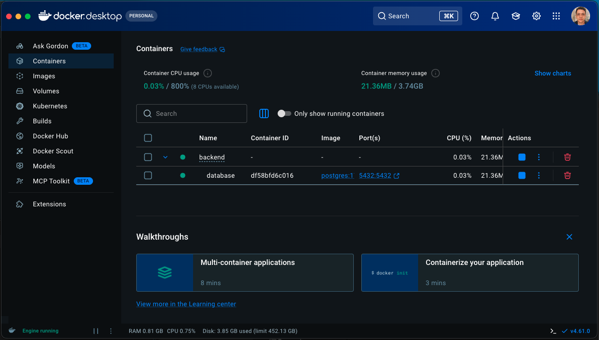
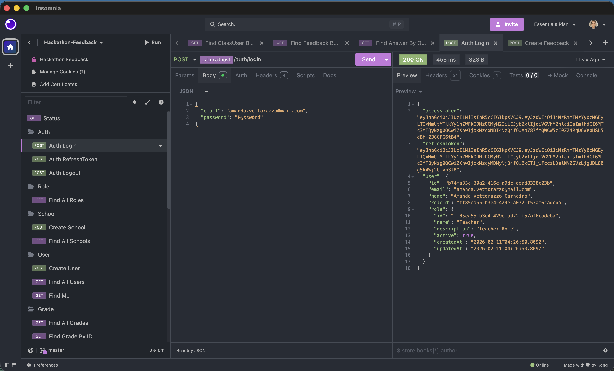
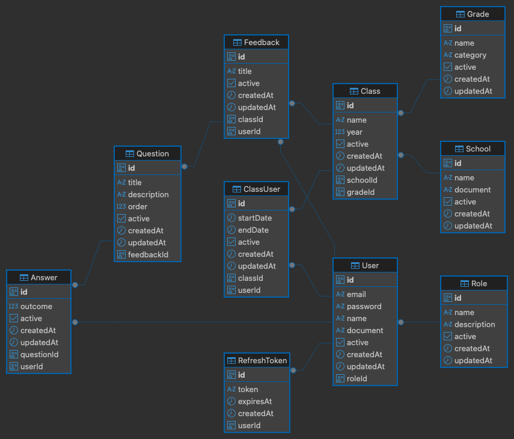
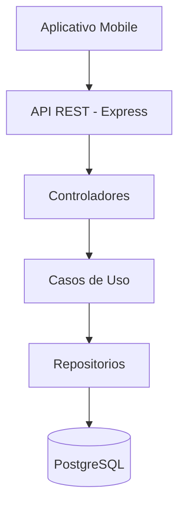

# Hackathon Feedback API - Backend

O **Hackathon Feedback API** é o serviço de back-end do projeto do hackathon com o tema **"Auxilio aos professores e professoras no ensino publico"**. O objetivo do projeto como um todo é oferecer uma plataforma que facilite o trabalho docente, promovendo eficiencia, criatividade e interação com os estudantes. Nesta fase, o backend fornece a camada de regras de negócio e persistência para o aplicativo de feedbacks de aulas, palestras e materias, atendendo **alunos, professores e escolas**.

[Repositório GitHub](https://github.com/RenatoBrunetti/fiap-postech-5fsdt-fase5-hackathon-backend)

## Screenshots

	<figure style="margin:0;text-align:center;">
		
		<figcaption>Conteiner PostgreSQL no Docker</figcaption>
	</figure>

 

	<figure style="margin:0;text-align:center;">
		
		<figcaption>Insomnia</figcaption>
	</figure>

 

  <figure style="margin:0;text-align:center;">
		
		<figcaption>Diagrama do Banco de Dados</figcaption>
	</figure>

  

# ⛭ Informacoes Tecnicas

## → Objetivo do serviço

- Centralizar regras de negócio e autorização (perfis de aluno, professor e escola).
- Expor uma API REST para cadastro de escolas, turmas, usuários, feedbacks e respostas.
- Persistir dados de forma segura, auditável e escalável.

## → Tecnologias utilizadas

- **Node.js** e **TypeScript** para runtime e tipagem.
- **Express** para a API REST.
- **TypeORM** com **PostgreSQL** para persistencia.
- **JWT** para autenticacao e autorização.
- **Zod** para validação de schemas.
- **Docker / Docker Compose** para conteinerização e banco local.
- **Jest**, **ESLint** e **Prettier** para testes e qualidade.

## → Arquitetura do sistema

O backend segue uma separacao clara de responsabilidades entre **rotas**, **controladores**, **casos de uso**, **repositorios** e **entidades**. Isso facilita a manutencao e a evolucao do sistema, mantendo as regras de negocio isoladas de detalhes de infraestrutura.

## → Banco de dados

O banco relacional **PostgreSQL** armazena os dados principais do dominio, incluindo usuarios, papeis, escolas, turmas, feedbacks, perguntas e respostas. O acesso e feito via **TypeORM**, com mapeamento de entidades e relacoes.

## → Execução local

Pre-requisitos:

- Node.js (LTS)
- Docker e Docker Compose (opcional para o banco)

Passos básicos:

1. Copie o arquivo `.env.example` para `.env` e preencha as variáveis.
2. Instale dependências: `npm install`
3. Execute em desenvolvimento: `npm run dev`

Opcional com Docker:

- Suba API e banco: `docker compose up -d`
